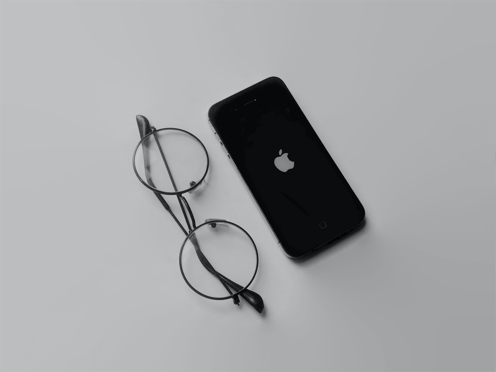

# Steve Jobs: Pioneer of the personal computer revolution

This tribute page is dedicated to Steve Jobs, the co-founder of Apple Inc. and a pioneer in the technology industry.

The goal of this page is to honour his contributions to the world of technology and showcase his legacy. The purpose of this tribute page is to provide a platform for users to learn about Steve Jobs' life, his achievements, and his impact on the tech industry. Through this page, users can gain a deeper understanding of Steve Jobs' vision and his innovative approach to technology. 

This tribute page provides value to users by inspiring them to think creatively and pursue their own passions, just as Steve Jobs did. The website also links to six other tech industry leaders to provide users with a broader understanding of the industry and its pioneers.

    

[View Steve Jobs Tribute Page repository in GitHub](https://github.com/Bowlesy666/Tribute-Page-PP1)

[View Steve Jobs Tribut page deployed on GitHub](https://bowlesy666.github.io/Tribute-Page-PP1/)

___

## Contents

* [UX](#UX)
  * [User Stories](#User-Stories)

* [Design](#design)
  * [Wireframes](#wireframes)
  * [Colour Scheme](#colour-scheme)
  * [Typography](#typography)
  * [Imagery](#imagery)

* [Features](#features)
  * [General Features](#general-features)
  * [Future Implementations](#future-implementations)
  * [Accessibility](#accessibility)

* [Technologies Used](#technologies-used)
  * [Languages Used](#languages-used)
  * [Frameworks, Libraries & Programs Used](#frameworks-libraries--programs-used)

* [Deployment & Local Development](#deployment--local-development)
  * [Deployment](#deployment)
  * [Local Development](#local-development)
    * [How to Fork](#how-to-fork)
    * [How to Clone](#how-to-clone)

* [Testing](#testing)

* [Credits](#credits)
  * [Code Used](#code-used)
  * [Content](#content)
  * [Media](#media)
  * [Acknowledgments](#acknowledgments)

___

## UX

### User Stories

#### Target Audience

The target audience for the tribute page are:

* Apple product consumers looking at the history of Apple inc. and the co-founder
* Technology enthusiasts
* Entreprenuers
* Innovators
* Students studying technology and business
* Fans of Steve Jobs and his work
* People seeking inspiration and motivation for their own passions and pursuits

#### Goals

The goals for this tribute page are:

* Honour Steve Jobs contributions to the world of technology
* Provide a platform for users to learn about Steve Jobs' life, achievements, and impact on the tech industry
* Inspire users to think creatively and pursue their own passions, just as Steve Jobs did

#### User Stories

* As a user, I want to be able to access a tribute page that honours Steve Jobs' contributions to the world of technology, so that I can learn more about his impact on the industry.

* As a user, I want the tribute page to provide a platform for me to learn about Steve Jobs' life, achievements, and impact on the tech industry, so that I can gain a better understanding of his legacy.

* As a user, I want the tribute page to inspire me to think creatively and pursue my own passions, just as Steve Jobs did, so that I can feel motivated to achieve my own goals.

* As a user, I want the tribute page to be easy to navigate and visually appealing, so that I can enjoy the experience of learning about Steve Jobs' life and legacy.

* As a user, I want the tribute page to include a variety of multimedia elements, such as photos and videos, so that I can engage with the content in different ways.

* As a user, I want the tribute page to be informative and engaging, so that I can feel like I am learning something new and interesting about Steve Jobs and his impact on the world of technology.

* As a user, I want an informative and aesthetically pleasing site I can keep returning to and use as a reference for Steve Jobs achievements.

___

## Design

### WireFrames: 

### Colour Scheme:

    

The colour scheme used in this project is a monochromatic colour scheme. It consists of shades of black, grey, and blue. 

The primary colour used is black (#000000), which represents elegance, sophistication, and power. It is used as the background colour to provide a neutral and timeless base for the other colours to stand out.

The secondary colour used is dark grey (#24252A), which adds depth and contrast to the design. It is used to highlight important elements and create a visual hierarchy.

The tertiary colour used is light blue (#a8a8fa), which adds a touch of colour and liveliness to the design. It represents creativity, innovation, and technology, which are all values associated with Steve Jobs.

The accent colour used is light grey (#c8c8c8), which is a softer version of the dark grey. It is used to create a subtle contrast and add texture to the design.

Finally, white (#ffffff) is used as the contrasting colour to ensure readability and legibility and give it that crisp and proffesional feel.

Overall, this colour scheme was chosen to create a sleek, modern, and sophisticated design that reflects Steve Jobs' impact on the world of technology.

### Typography: 

For this project I used the fonts Alata and Robot Slab for their unique and modern styles that fit well with the tribute page's sleek and sophisticated design. This will fall in line with many of the apple products which have time and time again proven to be sleek and sophisticated

    
    
Alata is a sans-serif font that is bold and geometric, making it perfect for headlines and titles. Its clean and modern style adds a touch of elegance to the design while also being easy to read. We used Alata for the main headings on the tribute page to create a strong visual impact.

    
    
Robot Slab, on the other hand, is a slab serif font that has a more traditional and classic feel. Its thick and sturdy lines make it perfect for body text and smaller headings. We used Robot Slab for the main body text on the tribute page to ensure readability and legibility.

    
    
Additionally, we used the Ionicons website to access the Apple computer logo font. This font is a custom-designed typeface that is used exclusively by Apple and is not available for public use. However, the Ionicons website provides a collection of icons and logos, including the Apple computer logo, that are free to use for personal projects. We used the Apple computer logo font to create a visual connection between Steve Jobs and Apple, as he was one of the co-founders and played a significant role in the company's success. Using this font helped to reinforce the tribute page's focus on Steve Jobs' contributions to the tech industry and his legacy.

### Imagery:

The imagery used on this website includes photos geared towards Steve Jobs, Apple products and Pixar. These images are used to provide visual interest and enhance the user experience.

#### Standardised Header/Nav Bar

    

The header/nav bar and footer are standardized across all pages of the website to provide consistency and ease of navigation for the user. The header has a reduced opacity as I felt is was more stylish and innovative to fall in line with Apple products and everything that Steve Jobs was involved in.

The nav bar includes two options: "Home" which takes the user to a scrolling page of five main sections, and "Contact Me" which takes the user to a page where they can submit a message to the website creator aswell as the logo, on the left, which will take the user to the Bowles full stack git hub page.

The logo is shown as an abstract letter B, that can be rotated 180 degrees and look like the letter B but in a different format, as well as a "Stack" of objects to represent several programming languages, again can be rotated 180 degrees and will show a different set or "Stack" of languages. The logo colour has been modified to tie in with the pages aesthetics.

#### Standardised Footer

    

A standardized footer is used to provide consistency across all pages of a website. It includes important information such as contact details, thank you and brief summary of why I chose this topic. 

A standardized footer can help to improve the overall user experience by providing a sense of familiarity and making the site easier to use. Overall, a standardized footer is an important design element.

#### Images and Initial Load Aesthetic

    

The initial loading of the Steve Jobs tribute page is designed to create a crisp and elegant aesthetic that symbolizes the starting point of Steve Jobs' career and his advances in technology. The page features a monochromatic color scheme with shades of black, grey, and the small hint of blue in the logo, which represents sophistication, power, and creativity. Overall, the initial loading of the page sets the tone for the rest of the tribute which progresses and develops into more colour and more wow factor.

#### Unsplash/Canva Royalty Free Images

    
    
Photo by <a href="https://unsplash.com/pt-br/@sushioutlaw?utm_source=unsplash&utm_medium=referral&utm_content=creditCopyText">Brian McGowan</a> on <a href="https://unsplash.com/photos/857R--_CvP0?utm_source=unsplash&utm_medium=referral&utm_content=creditCopyText">Unsplash</a>
  

Unsplash is a website that provides free high-quality images that can be used for personal or commercial projects. 

    
    
Photo by <a href="https://unsplash.com/@lighttouchedphotography?utm_source=unsplash&utm_medium=referral&utm_content=creditCopyText">Kevin Schmid</a> on <a href="https://unsplash.com/photos/KuruTiZGin8?utm_source=unsplash&utm_medium=referral&utm_content=creditCopyText">Unsplash</a>
  

Using Unsplash images in my project saved time and eliminated cost or the need to purchase licensed images. 

    
    
Photo by <a href="https://unsplash.com/@usmanyousaf?utm_source=unsplash&utm_medium=referral&utm_content=creditCopyText">Usman Yousaf</a> on <a href="https://unsplash.com/photos/-AQ-P_R25aI?utm_source=unsplash&utm_medium=referral&utm_content=creditCopyText">Unsplash</a>
  

Additionally, Unsplash images are often visually stunning and can add a professional and polished look to a project. Using Unsplash images enhanced the visual appeal of my project while also saving time and resources.

    
    
Canva free to use design, Yellow White Photo and Videocentric Error Page Website Error Page to symbolise ho wfar computers have come in Steve Jobs lifetime

    
    
This wa taken from a youtube tutorial! BUT I completed the tutorial before starting this project and did not re follow it line by line when implimenting it here, I started off referencing how it was structured with the container, the ::before and ::after for the reflections/highlights and continued on my own styling it in my own way

I left this in my project even though it was from a youtube tutorial as I feel like some things started to click for me with CSS and was a bit of a personal milestone. I changed things such as shape of droplet, highlights/shadows. i had changed the icon but reverted to the ionicon as i was unsure on copyright with using a genuine apple logo"

[View the Youtube waterdrop Tutorial Here](https://www.youtube.com/watch?v=GnllGn9Oifs)

#### Wikipedia Images and Links

    
    
pictures used in this section are taken from the wikipedia pages that they are anchored to and will be referenced in the credits section below

### Page Flow

#### Main Scrolling Page

This is the main page and consits of many major sections.

The flow is designed to start on load with an elegant monotone colour scheme and as the user begins to scroll they discover more colour, features, information and excitement. This symbolises the advancements in technology that has been seen over Steve Jobs lifetime.

Index Page Screenshots as whole project

 
  

      
      
      
      
  

  

Index Page Flow: Broken down into sections

* Header/Nav Bar, nav elements are in the top right designed for the mobile first approach, this perfect placement for users thumbs to press aswell as where eyes are drawn to. the space between links is sufficent for even clumsy users.

* Image and title to instantly let users understand the page intent

* Brief summary about Steve Jobs

* Audio file and transcript link so users can understand more about Steve jobs

* Vibrant image to showcase Pixar Film and break up the sections with a design element

* Milestones advances from brief overviews to now giving the choice of headings or full information, the details summary use gives the user both interaction and control over navigating the timeline of events and what specific information they wish view

* Waterdrop design element breaks up the sections and symbolises advancements in technology by showcasing CSS art rather than pre made images

* Testimonials sections shows the love that people feel for Steve Jobs, allowing the user to feel the same

* The "Further Links" description provides a sufficient explanation to enlighten users on the ongoing advancements in technology, this will motivate them to take action.

* Further links section has contemporary style headings on the links that are slightly offset to the left, pictures with rounded edges and :hover styles with big shadows showing the diversity of technology today

* Footer has a contrasted background to the rest fo the project as i wanted to show that it was the and of the page and also that it contained different type of information, it contains my information.

#### Contact & Thank You Pages

The Contact/ Thank You page did not fit in the flow of the main scrolling page so it was designed to stand alone. The header and footer were the same and the hero image has an Apple logo to keep continuity and familiarity with the website itself

Contact Page Screenshot

 
  

      
  

The contact page is designed for the user to give feedback, interesting features here include spambot checker a thank you message on completion and this form actually works by sending myself an email by using formsubmit.io

Thank you Page Screenshot

 
  

      
  

I wanted this to be fun and show a lighthearted thank you, as I am using Formsubmit.io I had to redirect from their own "your form has been submitted page" as it had no return links as well as no continuity with the site branding

#### 404 Page

The header and footer were the same and the hero image has an old looking computer monitor to keep continuity and familiarity with the website itself

404 Page Screenshot

 
  

      
  

I thought the image fit very well with the theme and what the page symbolised. the return links are there to redirect users back to the pages that are known to work.

___

## Features

* built using mobile first style, responsive for larger screen sizes

* Is accessibility compliant

* The website has audio element that if broken or user is unable to hear has an external transcript link

* The website features a standardized header/nav bar and footer for consistency and ease of navigation. 

* The nav bar includes links to the main page and a contact form strategically placed for mobile users

* The main page features a responsive title, audio playback element, CSS art, repsonsive gallery, milestones timeline of events and footer 

* The website also includes a 404 page and favicons for improved user experience. 

* The contact form allows users to submit messages to the website owner. 

* The website utilizes flexbox for layout styling

* The website utilises formsubmit.io for data submission.

* Footer has social icons linking to website owners social pages and header/footer logo links to github

* hover effects and pointer

* frosted glass effect on tetsimonial cards

___

## Technology Used

* HTML

* CSS

* Flexbox

* Formsubmit.io

* Canva

* Google fonts

* Font Awesome

* Ionicons

* Git for version control

* Github

* Gitpod

* Favicongenerator.org

* Coolors

* Am-i-responsive

* Balsamiq

* Google Dev Tools

### Accessibility

I have been checking that the website is accessible friendly at every stage using Lighthouse. i have also been mindful that I am:

* Using semantic HTML techniques.
* Using descriptive alt attributes on images on the site.
* Providing information for screen readers where there are icons used and no text. This has been actioned in the footer/header of the project.
* Ensuring that there is a sufficient colour contrast throughout the site.
* Adding a transcript option for the audio playback

___

## Deployment and Local Development

### Deployment

I have deployed my project using GitHub Pages. Click this [link](https://bowlesy666.github.io/Tribute-Page-PP1/index.html) to view the deplyed project.

To deploy the project I followed the below instructions:

1. Login or Sign Up to GitHub.
2. Open the project repository [here.](https://github.com/Bowlesy666/Tribute-Page-PP1)
3. Click on "Settings" on the navigation bar under the repository title.
4. Click on "Pages" in the left hand navigation panel.
5. In the Build and deployment section under "Source", choose which branch to deploy. This should be Main.
6. Choose which folder to deploy from, usually "/root".
7. Click "Save", then wait for it to be deployed. It can take some time for the page to be fully deployed and you may have to refresh the page after a couple of minutes.
8. Your URL will be displayed above "Source".
9. The prject will now be deployed

### Local Development

#### How to Fork

To fork the repository:

1. Log in (or sign up) to Github.
2. Go to the repository for this project, [Tribute-Page-PP1](https://github.com/Bowlesy666/Tribute-Page-PP1).
3. Click the Fork button in the top right corner.

#### How to Clone

To clone the repository:

1. Log in (or sign up) to GitHub.
2. Go to the repository for this project, [Tribute-Page-PP1](https://github.com/Bowlesy666/Tribute-Page-PP1).
3. Click on the code button, select whether you would like to clone with HTTPS, SSH or GitHub CLI and copy the link shown.
4. Open the terminal in your code editor and change the current working directory to the location you want to use for the cloned directory.
5. Type 'git clone' into the terminal and then paste the link you copied in step 3. Press enter.

___

## Testing

### Validators

* HTML has been validated with [W3C HTML5 Validator](https://validator.w3.org/).
* CSS has been validated with [W3C CSS Validator](https://jigsaw.w3.org/css-validator/)

### General Testing

* Each feature or section was tested using the validators and lighthouse at each stage for functionality and accessibility
* The form has validation and will not submit without correct information and also a spam bot checker to avoid spamming
* External links open in a new tab
* Internal links open in the same tab
* Family and slack peer review were used for feedback

### Mobile Testing

* The site was built in mobile first style so has been tested primarily for this
* predominantly tested on Safari as all family have iPhones

### Desktop Testing

* Site was developed on a HP laptop using chrome, also tested on microsoft Edge towards the end of the coding stages

### Bugs

#### Known Bugs

##### Fixed Bug

* Footer H6 was fine on the scrolling page but flagged as warning for accessibilty issues on the contact, thank you and 404 page as they had less content, i fixed this by utilising a class sleecetor for the styling and taking away the H6

##### Unfixed Fixed Bug

* During both peer and mentor review I was told about a white line on the right hand side of my project shows a sizing issue, I was unable to see this on my monitor but investigated it anyway, i followed suggestion to change a width from vw to % and as I am unable to see if it has changed anything I do not know if it is fixed. This is something i would like to fix after the course completion, time constraint left me unable to continue investigating

| Goals | How is goal achieved? | summary of checks |
| :--- | :--- | :--- |
| Honour Steve Jobs contributions to tech world | Using the details/summary milestones section | All drop downs work, information is readable and is an easy to follow the timeline of events |
| Provide a platform to learn about Steve jobs life, achievements and impact on technology | Flow of information | The flow of information takes you form Steve Jobs' childhood through his work history and milestines and to teh testimonials section where it shows he still has an influence on people even after his death |
| Inspire others to follow there passions and think creatively | Flow of information and how it leads to the further links section | Feedback from family shows they clciked on the further links and were interested in other achievements made by other people, this shows an added interest, that spark we were looking for |

##### Testing

| Feature | Type of Test | Expected Outcome | Result | Pass/Fail |
| ------- | ------------ | ---------------- | ------ | --------- |
| Header Logo | Hover| Background colour change | As Expected | Pass |
| Header Logo | Click | redirect to Github | As Expected | Pass |
| Nav links | Hover| Background colour change | As Expected | Pass |
| Nav links | Click | Open link on same tab | As Expected | Pass |
| Header title | Responsiveness | Overlay hero image on larger screen sizes | As Expected | Pass |
| Audio | Muted on load | Gives muted icon and no sound plays on click | As Expected | Pass |
| Audio | Controls displayed | Play button and time bar | As Expected | Pass |
| Milestones | on click | dropdown to show information | As Expected | Pass |
| Milestones | on click | dropdown to show information | As Expected | Pass |
| link to Apples remembering Steve Jobs page | on click | Link opens in new tab | As Expected | Pass |
| Further links gallery | responsiveness | Using lighthouse to view differnet screen sizes, gallery should change from 1 column on mobile up to 1 row only on 4k screen | As Expected | Pass |
| Further links gallery | Hover | Blue border and shadow | As Expected | Pass |
| Further links gallery | On click | Link opens in new tab | As Expected | Pass |
| Social media links | Hover | Size change | As Expected | Pass |
| Footer logo and social media links | on click | Link opens in new tab | As Expected | Pass |
| Contact form | Input/Required | cannot submit without required information | As Expected | Pass |
| Contact form | Spambot | cannot submit with spam type information | As Expected | Pass |
| Contact form | Submit | redirects to thank you page | As Expected | Pass |
| Thank you return links | On Click | Opens link in same tab | As Expected | Pass |
| 404 return links | On Click | Opens link in same tab | As Expected | Pass |

___

## Credits

### Unsplash

    
    
Photo by <a href="https://unsplash.com/pt-br/@sushioutlaw?utm_source=unsplash&utm_medium=referral&utm_content=creditCopyText">Brian McGowan</a> on <a href="https://unsplash.com/photos/857R--_CvP0?utm_source=unsplash&utm_medium=referral&utm_content=creditCopyText">Unsplash</a>
  

    
    
Photo by <a href="https://unsplash.com/@lighttouchedphotography?utm_source=unsplash&utm_medium=referral&utm_content=creditCopyText">Kevin Schmid</a> on <a href="https://unsplash.com/photos/KuruTiZGin8?utm_source=unsplash&utm_medium=referral&utm_content=creditCopyText">Unsplash</a>
  

    
    
Photo by <a href="https://unsplash.com/@usmanyousaf?utm_source=unsplash&utm_medium=referral&utm_content=creditCopyText">Usman Yousaf</a> on <a href="https://unsplash.com/photos/-AQ-P_R25aI?utm_source=unsplash&utm_medium=referral&utm_content=creditCopyText">Unsplash</a>
  

    
    
Photo by <a href="https://unsplash.com/@konseptastudio?utm_source=unsplash&utm_medium=referral&utm_content=creditCopyText">Konsepta Studio</a> on <a href="https://unsplash.com/photos/6n9dzMQr8X0?utm_source=unsplash&utm_medium=referral&utm_content=creditCopyText">Unsplash</a>
  

### Youtube Tutorial

    

[View the Youtube waterdrop Tutorial Here](https://www.youtube.com/watch?v=GnllGn9Oifs)

### Canva

    
    
Canva free to use design, Yellow White Photo and Videocentric Error Page Website Error Page

### Flexbox

Flexbox I had learned form Freecodecamp a long time ago

### Formsubmit.io

Utilised this to have the repsonses go to my email and impliment the spambot feature

### Other Credits

* Favicon-generator.org used to create the favicons

